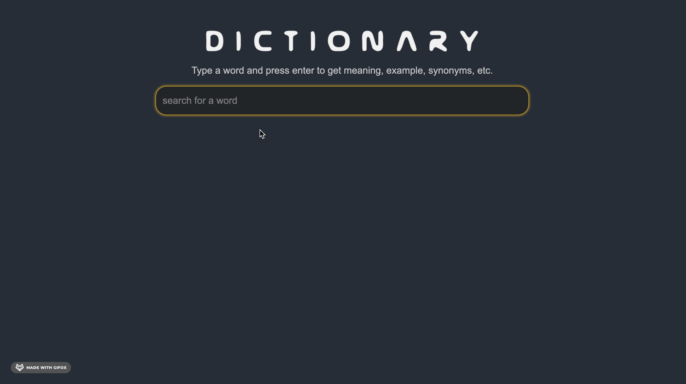

# Simple Dictionary

A simple online English dictionary using plain JavaScript and markup only. 
## Features

User can type in a word and view the different meanings and
examples of usage. It utilizes free dictionary REST API endpoint https://api.dictionaryapi.dev/api/v2/entries/en_US/<word>





## Getting Started

Follow these steps in order to get the website up and running locally on your machine.

### Installation

- `npm install` to install any dependencies
- `gulp webserver` to start a live reload session

```bash
## File Structure
├── app
│   ├── images
|   |   |__logo.png
│   │
│   ├── js
│   │   ├── dictionary.js
│   │   │
│   │   └── search.js
│   │
│   └── style
│       ├── search.css
```